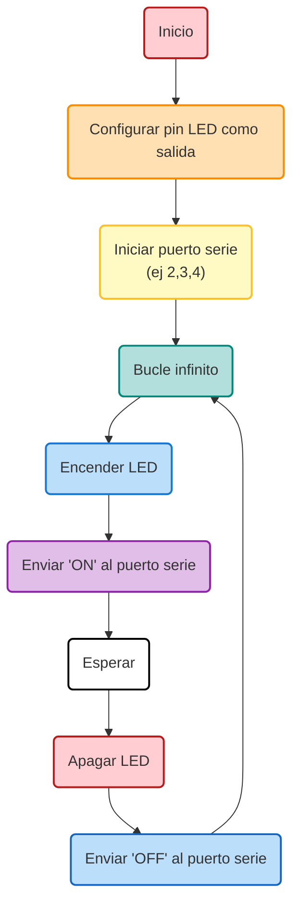

## Introducción 

En esta práctica se han hecho distintos experimentos para encender y apagar un LED en la ESP32-S3 utilizando diferentes codigos:


## Código 

### *Ejercicio 1*

```cpp
#include <Arduino.h>
#define LED_BUILTIN 2
#define DELAY 500

void setup() {
    pinMode(LED_BUILTIN, OUTPUT); }
void loop() {
    digitalWrite(LED_BUILTIN,HIGH);
    delay(DELAY);
    digitalWrite(LED_BUILTIN, LOW);
    delay(DELAY);
}
```

### *Ejercicio 2*

```cpp
#include <Arduino.h>
#define LED_BUILTIN 2
#define DELAY 1000

void setup() {
    pinMode(LED_BUILTIN, OUTPUT);
    Serial.begin(115200); }
void loop() {
    digitalWrite(LED_BUILTIN,HIGH);
    Serial.println("ON");
    delay(DELAY);
    digitalWrite(LED_BUILTIN, LOW);
    Serial.println("OFF");
    delay(DELAY);
}
```

### *Ejercicio 3*

```cpp
#include <Arduino.h>
#define LED_BUILTIN 2
#define DELAY 1000

void setup() {
    pinMode(LED_BUILTIN, OUTPUT);
    Serial.begin(115200); }

void loop() {
    uint32_t* gpio_out = (uint32_t*)GPIO_OUT_REG;
    *gpio_out |= (1 << LED_BUILTIN);
    Serial.println("ON");
    delay(DELAY);
    *gpio_out ^= (1 << LED_BUILTIN);
    Serial.println("OFF");
    delay(DELAY);
}

```

### *Ejercicio 4*

```cpp
#include <Arduino.h>

#define LED_PIN 2

void setup() {
    pinMode(LED_PIN, OUTPUT);
    Serial.begin(115200);
}

void loop() {
    uint32_t* gpio_out = (uint32_t*)GPIO_OUT_REG;

    // Caso 1: Con Serial.println() y digitalWrite()
    digitalWrite(LED_PIN, HIGH);
    Serial.println("ON");
    digitalWrite(LED_PIN, LOW);
    Serial.println("OFF");

    // Caso 2: Con Serial.println() y acceso a registros
    *gpio_out |= (1 << LED_PIN);
    Serial.println("ON");
    *gpio_out &= ~(1 << LED_PIN);
    Serial.println("OFF");

    // Caso 3: Sin Serial.println() y usando digitalWrite()
    digitalWrite(LED_PIN, HIGH);
    digitalWrite(LED_PIN, LOW);

    // Caso 4: Sin Serial.println() y acceso directo a registros 
    *gpio_out |= (1 << LED_PIN);
    *gpio_out &= ~(1 << LED_PIN);
}

```


## Diagrama de Flujo General



## Diagrama de Tiempos

En el **Ejercicio 4**, se realizaron mediciones de la frecuencia máxima de encendido/apagado del LED bajo distintas condiciones:

| Caso | Método               | Con Serial.println() | Frecuencia Medida |
|------|----------------------|----------------------|-------------------|
| 1    | `digitalWrite()`     | Sí                   | Baja              |
| 2    | Acceso a registros   | Sí                   | Media             |
| 3    | `digitalWrite()`     | No                   | Alta              |
| 4    | Acceso a registros   | No                   | Máxima            |

----------

 **Lulu Armoire Palomar**


> Written with [StackEdit]
